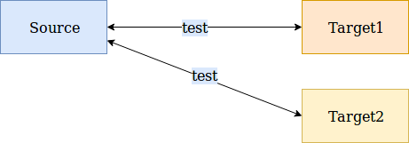

# dda-serverspec-crate

[](https://clojars.org/dda/dda-serverspec-crate)
[](https://travis-ci.org/DomainDrivenArchitecture/dda-serverspec-crate)

[](https://clojurians.slack.com/messages/#dda-pallet/) | [ DevOps Hacking with Clojure](https://www.meetup.com/de-DE/preview/dda-pallet-DevOps-Hacking-with-Clojure) | [Website & Blog](https://domaindrivenarchitecture.org)

## Compatibility
dda-pallet is compatible to the following versions
 * pallet 0.8
 * clojure 1.7
 * (x)ubunutu 16.04

## Usage documentation
This crate provides integration tests for servers.

### Usage Summary
1. Download the jar from the releases page of this repository
2. Deploy jar on the source machine
3. Create test.edn (Domain-Schema for Tests) and target.edn (Schema for Targets) according to the reference and our example configs
4. Run the jar with the following options and inspect the output.
```bash
java -jar dda-serverspec-crate-standalone.jar test.edn targets.edn
```

### Remote-whitebox


For the remote whitebox test, the serverspec crate can be used from a source machine to test remote target machines.
This can be achieed by either utilizing the jar provided on GitHub, or by calling the functions of the source code directly.

### Configuration
The configuration of this crate can be distinguished into two categories - the configuration for the actual tests to be executed, and the configuration for the target nodes which should be tested.
Usually all of the dda-pallet crate provide an integration folder, which is responsible for handling the configuration and calling the underlying infrastructure utilities. In order to utilize the integration
functionality, an IDE and basic clojure knowledge is required. A more convenient way is to use the jar provided on Github. This jar can be downloaded and .edn configuration files will be used to customize the
tests to be executed. Two configuration file will be necessary to call the main method successfully. The first argument requires the configuration for the actualy tests for this crate, while the second configuration
file is responsible for the target nodes. The following examples will make the creation of these files more clear. Please note that, we will reference the files for the test configuration and target configuration "test.edn"
and "targets.edn", respectively.

#### Targets config
```clojure
{:existing [{:node-name "test-vm1"
             :node-ip "35.157.19.218"}
            {:node-name "test-vm2"
             :node-ip "18.194.113.138"}]
 :provisioning-user {:login "ubuntu"}}
```
The keyword :existing has to be assigned a vector that contains maps of the information about the nodes.
The nodes are the target machines that will be tested. The node-name has to be set to be able to identify the target machine and the node-ip has to be set so that the source machine can reach it.
The provsioning-user has to be the same for all nodes that are to be tested. Furthermore, if the public-key of the executing host is authorized on all target nodes,
a password for authorization can be ommitted. If this is not the case the provisioning user has to contain a password. This can be seen by the schema for the targets.

#### Test config
```clojure
{:netstat [{:process-name "sshd" :port "11" :running? false}
           {:process-name "sshd" :port "22"}
           {:process-name "sshd" :port "22" :exp-proto "tcp6" :ip "::"}]
 :file [{:path "/root"}
        {:path "/etc"}
        {:path "/absent" :exist? false}]
 :netcat [{:host "www.google.com" :port 80}
          {:host "www.google.c" :port 80 :reachable? false}]
 :package [{:name "test" :installed? false}
           {:name "nano"}]}
```         
The test config determines the test that are executed. At the moment we have four different types of
tests that can be configured. The exact details can be found down in the reference.

### Test with jar-file
For a more convenient usage we created a jar file of the serverspec-crate. It can be found at [here](https://github.com/DomainDrivenArchitecture/dda-serverspec-crate/releases) or by navigating to the releases page of this repo.

```bash
java -jar dda-serverspec-crate-standalone.jar test.edn targets.edn
```

## Reference

The Infra configuration is a configuration on the infrastructure level of a crate. It contains the complete configuration options that are possible with the crate functions.
The Infra configuration is not very convenient in most use case scenarios as it can be quite complex. The domain configuration acts as an abstraction of the Infra configuration to provide
the most important configuration without adding the overhead of the Infra configuration. It is much more convenient in its usage and should be preferred in most use cases.
Furthermore, functions in the domain namespace will create an infrastructure configuration from the domain config. This can be seen by comparing the Domain-Schema and Infra-Schema provided below.
In contrast to the Domain-Schema, the Infra-Schema references the configuration used at the most bottom level functions in the respective namespaces.


### Schema for Targets

```clojure
(def ExistingNode {:node-name s/Str
                   :node-ip s/Str})

(def ProvisioningUser {:login s/Str
                       (s/optional-key :password) s/Str})

(def Targets {:existing [ExistingNode]
              :provisioning-user ProvisioningUser})
```
The "targets.edn" has the schema of the Targets
### Domain-Schema for Tests

```clojure
(def ServerTestDomainConfig {(s/optional-key :package) [{:name s/Str
                                                         (s/optional-key :installed?) s/Bool}]
                             (s/optional-key :netstat) [{:process-name s/Str
                                                         :port s/Str
                                                         (s/optional-key :running?) s/Bool
                                                         (s/optional-key :ip) s/Str
                                                         (s/optional-key :exp-proto) s/Str}]
                             (s/optional-key :file) [{:path s/Str
                                                      (s/optional-key :exist?) s/Bool}]
                             (s/optional-key :netcat) [{:host s/Str
                                                        :port s/Num
                                                        (s/optional-key :reachable?) s/Bool}]})

```
The "tests.edn" has the schema of the ServerTestDomainConfig-variable.
### Infra-Schema for Facts & Tests
```clojure
(def ServerTestConfig {(s/optional-key :package-fact) s/Any
                       (s/optional-key :netstat-fact) s/Any
                       (s/optional-key :file-fact) file-fact/FileFactConfig
                       (s/optional-key :netcat-fact) netcat-fact/NetcatFactConfig
                       (s/optional-key :package-test) package-test/PackageTestConfig
                       (s/optional-key :netstat-test) netstat-test/NetstatTestConfig
                       (s/optional-key :file-test) file-test/FileTestConfig
                       (s/optional-key :netcat-test) netcat-test/NetcatTestConfig})
```

## License
Published under [apache2.0 license](LICENSE.md)
