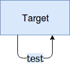

# dda-serverspec-crate

[](https://clojars.org/dda/dda-serverspec-crate)
[](https://travis-ci.org/DomainDrivenArchitecture/dda-serverspec-crate)

[](https://clojurians.slack.com/messages/#dda-pallet/) | [ DevOps Hacking with Clojure](https://www.meetup.com/de-DE/preview/dda-pallet-DevOps-Hacking-with-Clojure) | [Website & Blog](https://domaindrivenarchitecture.org)

## Jump to
[Compatibility](#compatibility)  
[Features](#features)  
[Local-remote-testing](#local-remote-testing)  
[Usage Summary](#usage-summary)  
[Targets-config-example](#targets-config-example)  
[Serverspec-config-example](#serverspec-config-example)  
[Reference-Targets](#targets)  
[Reference-Domain-API](#domain-api)  
[Reference-Infra-API](#infra-api)  
[License](#license)

## Compatibility
dda-pallet is compatible with the following versions
 * pallet 0.9
 * clojure 1.9
 * (x)ubunutu 16.04.x || 18.04

## Features
The dda-serverspec-crate allows you to specify expected state for target-systems and test against their current state. dda-serverspec-crate provides tests for:
 * execution against localhost, remote hoste or multiple remote hosts.
 * files or folders presence / absence, plus specific FilePermissions/group/owner.
 * packages are installed / uninstalled
 * services listening to ip & port
 * validity of local certificate files
 * validity of certificates by https - maybe remote or localhost.
 * network connectivity to remote systems

  <a href="https://asciinema.org/a/163372?autoplay=1"></a>

## Local-remote-testing
There are two modes of testing targets, either local or remote. Local tests are executed on the system the jar is running on. Local tests are executed by the current user.



Remote tests are collection state (we name it facts) from target system on compare these facts against expectation on the system executing the dda-serverspec jar.
Facts are collected via ssh & bash. Test utils, needed, can be installed by using the installation phase (use `--install-dependencies` on the command line).


## Usage Summary
1. **Download the jar-file** from the releases page of this repository (e.g. `curl -L -o serverspec.jar https://github.com/DomainDrivenArchitecture/dda-serverspec-crate/releases/download/1.1.2/dda-serverspec-crate-1.1.2-standalone.jar`)
1. Deploy the jar-file on the source machine
1. Create the files `serverspec.edn` (Domain-Schema for all your tests) and `target.edn` (Schema for Targets to be provisioned) according to the reference and our example configurations. Please create them in the same folder where you've saved the jar-file. For more information about these files refer to the corresponding information below.

5. Start testing:
```bash
java -jar dda-serverspec-crate-standalone.jar --targets targets.edn serverspec.edn
```
If you want to test on your localhost you don't need a target config.
```bash
java -jar dda-serverspec-crate-standalone.jar serverspec.edn
```

## Configuration
The configuration consists of two files defining both WHERE to test and WHAT to test.
- example-targets.edn: describes on which target system(s) the software will be installed  
- example-ide.edn: describes which software/packages will be installed  

You can download examples of these configuration files from  
[example-targets.edn](example-targets.edn) and   
[example-serverspec.edn](example-serverspec.edn) respectively.

#### Targets config example
Example content of the file, `example-targets.edn`:
```clojure
{:existing [{:node-name "test-vm1"          ; semantic name
             :node-ip "35.157.19.218"}      ; the ip4 address of the machine to be provisioned
            {:node-name "test-vm2"
             :node-ip "18.194.113.138"}]
 :provisioning-user
  {:login "initial"                         ; account used to provision
   :password {:plain "secure1234"}}}        ; optional password, if no ssh key is authorized
```

#### Serverspec config example
Example content of the file, `example-serverspec.edn`:
```clojure
{:netstat [{:process-name "sshd" :port "11" :running? false}
           {:process-name "sshd" :port "22" :ip "0.0.0.0" :exp-proto "tcp"}
           {:process-name "sshd" :port "22" :ip "::" :exp-proto "tcp6"}
           {:process-name "dhclient" :port "68" :ip "0.0.0.0"}]
 :file [{:path "/root/.bashrc" :user "root"}
        {:path "/etc"}
        {:path "/absent" :exist? false}
        {:path "/root/.profile" :mod "644" :user "root" :group "root"}
        {:path "/etc/resolv.conf" :link-to "../run/resolvconf/resolv.conf"}]
 :netcat [{:host "www.google.com" :port 80}
          {:host "www.google.c" :port 80 :reachable? false}]
 :package [{:name "test" :installed? false}
           {:name "nano"}]
 :http [{:url "https://domaindrivenarchitecture.org"
         :expiration-days 15}]}
```

### Watch log for debug reasons
In case any problems occur, you may want to have a look at the log-file:
`less logs/pallet.log`

## Reference
Some details about the architecture:
* target: How targets can be specified
* Domain-Level-API: The high level API with built-in conventions.
* Infra-Level-API: If these conventions don't fit your needs, you can use our low-level API (infra) and easily realize your own conventions.

### Targets
You can define provisioning targets using the [targets-schema](https://github.com/DomainDrivenArchitecture/dda-pallet-commons/blob/master/doc/existing_spec.md)

### Domain API
You can use our conventions as a starting point:
[see domain reference](doc/reference_domain.md)

### Infra API
Or you can build your own conventions using our low level infra API. We will keep this API backward compatible whenever possible:
[see infra reference](doc/reference_infra.md)

## License
Copyright © 2015, 2016, 2017, 2018 meissa GmbH
Published under [apache2.0 license](LICENSE.md)
